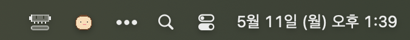
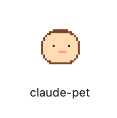

# claude-pet

A tiny desktop pet that lives in the corner of your screen and reacts to Claude Code events.
When Claude is waiting for your YES/NO answer on an inline permission prompt, the pet snaps to a surprised face, **bounces up and down**, and a red **`!`** pops up next to its head — so you can tell from across the room that Claude needs you.

## The pet

| Idle | Waiting for you (bouncing + `!`) |
|:-:|:-:|
|  |  |
| Sits quietly while Claude is working. | Bounces continuously with a red exclamation mark until you respond. |

The pet is rendered as a 32×32 pixel-art face inside a rounded 160×160 frame and stays on top of all windows. It's hidden from the Dock and only appears in the menu-bar tray.

## Menu bar tray icon

The macOS menu-bar tray icon **mirrors the pet's mood**, so you can still tell Claude needs you even when the pet window is hidden, dragged off-screen, or covered by another window.

Here's how it looks in the real menu bar (top-right corner of the screen, next to the clock and Control Center icons):



| Idle | Waiting for you |
|:-:|:-:|
|  |  |
| Beige bread — same as the pet face. | Recoloured bright red the moment any tracked session goes into `waitingForUser`. |

The main process polls `~/.claude/hooks/claude-pet/state.json` once a second and swaps the tray image automatically — no restart, no extra config. Sessions whose last event is older than 10 minutes are treated as stale and ignored (same threshold the pet window uses), **and any "waiting" signal older than 60 seconds is also ignored** (see [Auto-clear policy](#auto-clear-policy) below). The tray itself sits in the top-right of the macOS menu bar; `LSUIElement: true` keeps the app out of the Dock and ⌘+Tab.

## How it reacts to Claude Code events

The pet listens for Claude Code hooks (see [Claude Code hooks docs](https://code.claude.com/docs/en/hooks)) and only reacts for sessions whose `cwd` is in your tracked-project allowlist.

| Hook event | Pet behavior |
|---|---|
| `PermissionRequest` — Claude is asking you to allow a tool (e.g. *"Allow this bash command? [1 Yes / 2 No]"*) | **Surprised face** + bounce animation + red `!` |
| `Notification` — fallback signal (used in some Claude Code configurations) | **Surprised face** + bounce + `!` |
| `UserPromptSubmit` — you sent Claude a new prompt | Back to normal |
| `PostToolUse` — the tool finished running | Back to normal |
| `PermissionDenied` — auto-denied without prompting you | Back to normal |
| `Stop` / `StopFailure` — Claude finished its response (or was interrupted) | Back to normal |
| `PostToolUseFailure` — the tool ran but threw an error | Back to normal |

The surprised animation is purely CSS — a 0.55s `translateY` keyframe loop on the face plus a rotate/scale wiggle on the `!`. Stops the moment any "back to normal" event fires.

### Auto-clear policy

> ⚠️ **The pet automatically returns to normal after ~60 seconds even if no "back to normal" event arrives.**
>
> Why this matters: Claude Code sometimes leaves a "waiting" SET in the state file without ever firing a matching `PostToolUse` / `PermissionDenied` (certain tool types, ESC-cancelled prompts, agent / MCP calls). Without a fallback the pet would stay red until the 10-minute stale window closed.
>
> Two safety nets in `main.js` and `renderer/renderer.js`:
> - `WAIT_TIMEOUT_MS = 60_000` — a session is only treated as waiting if its last "set" timestamp is at most 60 seconds old.
> - `STALE_SESSION_MS = 10 * 60 * 1000` — sessions whose last event of any kind is over 10 minutes old are ignored entirely.
>
> **Real YES/NO prompts are answered well within 60 s, so normal flow looks unchanged.** Orphaned signals self-clear in ≤60 s instead of ≤10 min.

## Two ways to run it

### A. Dev mode (no packaging)

```bash
git clone https://github.com/pym7857/claude-pet.git
cd claude-pet
npm install
node scripts/install-hooks.js     # register Claude Code hooks
npm start                         # launch the pet (first run creates config.json)
```

Edit `config.json` (created from `config.example.json`) and add the absolute paths of projects you want to track:

```json
{
  "projects": ["/Users/me/Desktop/my-project"],
  "petPosition": "bottom-right",
  "petSize": 160,
  "pollIntervalMs": 500
}
```

### B. Packaged `.app` + auto-start at login

After installing dependencies and (optionally) registering hooks from source:

```bash
npm install
npm run dist                                            # build dist/mac-arm64/claude-pet.app

mv dist/mac-arm64/claude-pet.app /Applications/         # move to a stable location

# re-register hooks so they point at the .app (not the source folder)
node /Applications/claude-pet.app/Contents/Resources/app/scripts/install-hooks.js

npm run autostart:install                               # install macOS LaunchAgent
```

Once the `.app` is in `/Applications/`, it behaves like any other macOS application — you can launch it at any time without `npm start`:

<p align="right"></p>

- **Finder**: open `/Applications/`, double-click **claude-pet** (icon shown on the right).
- **Spotlight**: ⌘+Space → type "claude-pet" → Return.
- **Terminal**: `open /Applications/claude-pet.app`.

The hook re-registration and `autostart:install` steps above are optional conveniences; you can skip both and still launch the pet manually via any of the methods just listed.

After this:
- The pet launches immediately.
- Every login the pet starts automatically — no terminal, no `npm start`.
- Your config lives at `~/Library/Application Support/claude-pet/config.json` (the source `config.json` is only used in dev mode).
- To open the config quickly:
  ```bash
  open -e "$HOME/Library/Application Support/claude-pet/config.json"
  ```

Remove auto-start:

```bash
npm run autostart:uninstall
```

Remove hooks:

```bash
node scripts/install-hooks.js --uninstall
```

> **Code signing note:** The `.app` is not signed (no Apple Developer ID). The first time you double-click it from Finder, macOS Gatekeeper may complain. Right-click → **Open** to bypass it once.

### When do I need to rebuild the `.app`?

| You changed... | Dev mode (`npm start`) | Packaged `.app` |
|---|---|---|
| `main.js` / `preload.js` / `renderer/*` / `lib/*` | restart `npm start` | **rebuild required** |
| `scripts/gen-assets.js` or any pixel art | `npm run gen-assets`, then restart | **rebuild required** |
| `hooks/on-event.js` | nothing — Claude Code re-spawns it per event | nothing if hooks point at the source folder; **re-install hooks** if you want the `.app` copy to be used |
| `~/.claude/settings.json` (hook registration) | nothing | nothing |
| `config.json` (`projects`, etc.) | picked up within `pollIntervalMs` | picked up within `pollIntervalMs` |

To rebuild and replace the installed `.app` in one go:

```bash
npm run deploy
```

Which runs `gen-assets` → `dist` → removes `/Applications/claude-pet.app` → moves the freshly-built `dist/mac-arm64/claude-pet.app` into `/Applications/`. (Apple Silicon path is hard-coded; on Intel Macs swap `mac-arm64` for `mac-x64` in `package.json`.)

So in practice: **iterate with `npm start`**, and only run `npm run deploy` when you want to ship the changes to the auto-start / Finder-launched copy.

## Configuration reference (`config.json`)

| Key | Default | Meaning |
|---|---|---|
| `projects` | `[]` | Absolute paths to track. Subdirectories of any listed path also match. Empty = nothing is tracked, pet stays idle. |
| `petPosition` | `"bottom-right"` | One of `bottom-right`, `bottom-left`, `top-right`, `top-left`. |
| `petSize` | `160` | Pet window size in pixels. |
| `pollIntervalMs` | `500` | How often the renderer re-reads the hook state file. |

Changes to `config.json` take effect within `pollIntervalMs` — no restart needed for `projects` updates.

## Interactions

- **Hover** — slides up a panel showing the list of tracked projects (the last two path segments, full path as native tooltip).
- **Drag** — click and drag anywhere on the pet to move it. Position resets to `petPosition` on next launch.
- **Tray icon** — *Show / Hide / Quit* menu from the macOS menu bar.

## Replacing the pixel art

Drop your own PNGs into `renderer/assets/`:

- `normal.png` — idle face (also used as the idle menu-bar tray icon)
- `surprised.png` — waiting-for-you face (pet window)
- `surprised-red.png` — alert menu-bar tray icon

Any square size works; CSS uses `image-rendering: pixelated` so pixel art stays crisp at any scale. If you want to also update the `.app` icon, drop a 1024×1024 PNG at `build/icon.png` and rebuild with `npm run dist`.

To regenerate the bundled pixel art from the ASCII art in `scripts/gen-assets.js`:

```bash
npm run gen-assets
```

## How it works

```
Claude Code event  →  hook command (~/.claude/settings.json)
                      → node hooks/on-event.js <eventArg>
                      → checks cwd against config.json projects whitelist
                      → writes ~/.claude/hooks/claude-pet/state.json

Electron renderer  →  polls state.json every 500 ms
                      → switches face / triggers bounce + `!`
```

Two important paths:

| Mode | `config.json` location |
|---|---|
| Dev (`npm start`) | inside the source folder |
| Packaged (`.app`) | `~/Library/Application Support/claude-pet/` |

The `.app` ships with `config.example.json` and copies it on first launch. The same file is used by the hook handler when invoked from inside the packaged bundle — so `npm start` and the `.app` never fight over the same file.

## Project layout

```
claude-pet/
├── main.js                     # Electron main process
├── preload.js                  # contextBridge: state/config/drag IPC
├── config.example.json         # template — copied to config.json on first launch
├── lib/
│   └── paths.js                # dev vs packaged path resolution
├── renderer/
│   ├── index.html
│   ├── styles.css              # frame, bounce keyframes, tooltip, exclamation
│   ├── renderer.js             # state polling, mood switching, project list
│   └── assets/
│       ├── normal.png
│       ├── surprised.png
│       └── surprised-red.png      # alert tray icon (recoloured)
├── hooks/
│   └── on-event.js             # Claude Code hook handler (cwd filter)
├── scripts/
│   ├── gen-assets.js           # zero-dep PNG generator for faces + icon
│   ├── install-hooks.js        # add/remove our hooks in ~/.claude/settings.json
│   └── autostart.js            # macOS LaunchAgent install/uninstall
├── build/
│   └── icon.png                # 1024×1024 icon for the .app bundle
└── docs/
    ├── face-normal.png         # used in this README
    ├── face-surprised.png
    ├── face-red.png            # tray alert variant, used in README
    ├── finder-icon.png         # /Applications/ Finder screenshot, used in README
    └── menu-bar.png            # macOS top menu bar screenshot, used in README
```

## npm scripts

| Command | What it does |
|---|---|
| `npm start` | Run the pet in dev mode. |
| `npm run dev` | Same as `start` but opens DevTools. |
| `npm run gen-assets` | Regenerate all pixel-art PNGs from the ASCII art. |
| `npm run install-hooks` | Register Claude Code hooks. |
| `npm run uninstall-hooks` | Remove registered hooks. |
| `npm run reset-state` | Delete the hook state file (use if the pet is stuck on surprised). |
| `npm run dist` | Build `dist/mac-arm64/claude-pet.app`. |
| `npm run deploy` | `gen-assets` + `dist` + replace `/Applications/claude-pet.app` in one shot. |
| `npm run autostart:install` | Install macOS LaunchAgent (auto-start at login). |
| `npm run autostart:uninstall` | Remove the LaunchAgent. |
| `npm run setup` | One-shot: `gen-assets` → `dist` → `install-hooks` → `autostart:install`. |

## Troubleshooting

### How do I quit the pet?

Normally: top-right of the macOS menu bar → click the **bread tray icon** → **Quit**. (The pet has `LSUIElement: true` so it never appears in the Dock or ⌘+Tab — the tray is the only normal UI for quitting.)

If the tray icon is missing, hidden behind a menu-bar manager (Bartender / Ice), or just unresponsive, kill it from the terminal:

```bash
# Dev mode (started with `npm start` from the source folder)
pkill -f "claude-pet"

# Packaged .app (started by double-clicking /Applications/claude-pet.app)
killall "claude-pet" 2>/dev/null

# Last resort if either of the above hangs
pkill -9 -f claude-pet
```

After that you can relaunch with `npm start` or by opening the `.app` again.

### The pet stays surprised after I click YES/NO

Most common cause: a previous Claude Code session was killed while waiting for a permission prompt, so its `waitingForUser: true` is still sitting in the state file.

Quick fix:

```bash
npm run reset-state    # deletes ~/.claude/hooks/claude-pet/state.json
```

The renderer also automatically ignores sessions whose last event is older than 10 minutes, **and any "waiting" SET older than 60 seconds**, so the pet self-recovers even without a manual reset. See [Auto-clear policy](#auto-clear-policy) for the rationale. To trace the issue, tail the event log:

```bash
tail -f ~/.claude/hooks/claude-pet/events.log
```

You'll see one line per hook invocation — useful for spotting missing `tool-post`/`tool-fail`/`stop` events.

### After updating, hooks aren't firing correctly

The hook event list may have changed. Re-run the installer to sync `~/.claude/settings.json`:

```bash
node scripts/install-hooks.js     # idempotent — replaces any previous claude-pet entries
```

## Notes

- Tested on macOS (Apple Silicon). Linux / Windows are untested.
- Inside VSCode's integrated terminal, `ELECTRON_RUN_AS_NODE=1` is inherited from the parent process and blocks GUI mode. `npm start` and `npm run dev` unset it automatically; if you launch `electron .` manually, clear that variable yourself.
- `sandbox: false` is set on the BrowserWindow so the preload script can use Node modules (`fs`, etc.). This is safe here because no untrusted content is loaded.
- `process.execPath` is baked into the hook commands at install time, so the hooks fire even when Claude Code launches them in a stripped-down shell that doesn't have `node` on `PATH`.
